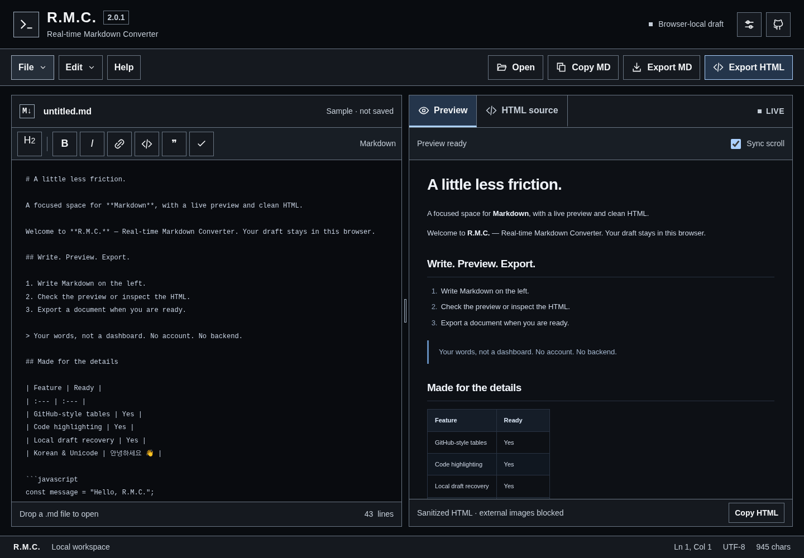

# R.M.C. - Real-time Markdown Converter

**다크모드 Markdown 작업 공간. 계정과 백엔드 없이 작성하고, 확인하고, 내보냅니다.**

[English](README.md) · [배포 안내](docs/deployment.md) · [아키텍처](docs/ARCHITECTURE.md) · [리팩터링 검토](docs/AUDIT-KR.md) · [검증 범위](docs/QA-REPORT.md)



> 이 ZIP은 **2.0.2 정적 배포 보완본**입니다. 2.0.1 인계본과 원격 저장소 `4660cf661aeb6a1345e5d16634791f8f13affe77`을 기준으로 검토했으며, 원격에 직접 반영하지 않았습니다. 화면 캡처는 격리 UI 테스트이며 실호스팅 변환기 실행의 증명은 아닙니다.

## 기존 사이트에 적용하기

**[UPGRADE-KR.md](UPGRADE-KR.md)를 먼저 확인하십시오.** ZIP 덮어쓰기만으로 구버전 파일이 삭제되지는 않습니다. `npm run migrate`로 사전 확인하고, `npm run migrate -- --apply`로 확인된 구버전 원본만 저장소 바깥으로 백업한 뒤 `npm run check:all`을 실행합니다. 수정된 파일과 브라우저 초안은 삭제하지 않습니다.

이번 변경은 **CSS·전체 모듈·Worker URL의 버전 구분**, CSS 누락 시 SVG 크기 폭주 방지, 독립 부팅 오류 안내, 실제 배포 파일 검증 명령입니다. 2.0.1의 다크모드·가독성·각진 디자인과 문서 스타일은 유지합니다. GitHub Pages는 여전히 **main / root 브랜치 정적 배포**로 사용할 수 있습니다. 별도 백엔드나 Vite 빌드가 필요하지 않습니다.

```powershell
npm.cmd run check:deployment -- https://jtech-co.github.io/RMC/
```

배포 점검은 공개 HTTP 응답과 `release.json`의 일치를 검사하며 앱 실행·외부 CDN 검증을 대신하지 않습니다. 기본 CDN 방식과 이전 라이브러리 버전 설정은 유지했습니다.

## UI 가독성 개선 (2.0.1)

메뉴·주요 버튼·파일명·출력 탭은 기본 **16px**, 저장 상태·보조 안내·상태 표시줄은 **14px**로 조정했습니다. UI의 작은 고정폭·넓은 자간 대신 시스템 산세리프 글꼴을 사용합니다. 밝은 중성색 텍스트, 식별하기 쉬운 외곽선, 각진 버튼·패널·대화상자를 적용하고 파란색은 선택·포커스 중심으로 제한했습니다. 비활성 버튼도 불투명도를 낮추지 않고 점선 테두리로 구분합니다.

변경 대상은 **RMC의 조작 UI이며 문서 본문이 아닙니다**. 에디터 글자 크기, 미리보기 타이포그래피, HTML 소스 스타일, 내보내기에 쓰는 `css/document.css`는 유지했습니다. 좁은 화면에서는 글자를 축소하는 대신 일부 직접 실행 버튼을 File 메뉴에서 이용하도록 했으며, Help도 해당 메뉴에서 접근할 수 있습니다. UI 전용 토큰은 `css/styles.css`의 `--ui-*`에 모았습니다.

[모바일 에디터](docs/screenshots/mobile.png) · [모바일 미리보기](docs/screenshots/mobile-preview.png) · [설정 화면](docs/screenshots/settings.png) · [상세 변경 기록](docs/UI-UPDATE-KR.md)

## 소개

R.M.C.는 Markdown 원문을 작성하면서 미리보기와 HTML 소스를 확인하는 정적 웹앱입니다. 기존의 다크모드·IDE형 구성을 유지하면서, 데스크톱의 크기 조절 가능한 두 패널과 모바일의 Markdown / Preview / HTML 전환 화면으로 재구성했습니다. 프레임워크, 번들러, 실행 중 CSS를 만드는 Tailwind Play CDN, 아이콘 폰트, 외부 웹폰트를 사용하지 않습니다.

일반 Markdown, GFM 표·체크리스트·취소선, 코드 블록, 링크 등을 지원합니다. 툴바와 단축키로 선택 영역을 편집하고, Markdown 원문 또는 정제된 HTML 조각을 복사할 수 있습니다. 미리보기·HTML 소스·HTML 복사·HTML 파일은 동일한 정제 결과를 사용합니다. HTML을 보기 좋게 정렬한다는 이유로 코드의 들여쓰기나 줄바꿈을 바꾸지 않습니다.

작성 중인 초안은 현재 브라우저에 자동 저장합니다. 새 문서·파일 열기·복구 작업에는 확인 대화상자와 직전 문서 백업을 적용했습니다. UTF-8 `.md`, `.markdown`, `.txt` 파일을 불러올 수 있고, Markdown 파일과 스타일을 포함한 HTML 파일로 내보낼 수 있습니다. 내보낸 HTML도 화면에서는 다크 스타일을 사용하며 인쇄할 때만 밝은 종이 스타일로 바뀝니다.

## 바로 실행하기

개발 도구에는 **Node.js 22 이상**을 사용합니다.

```bash
cd RMC
npm run dev
```

브라우저에서 **http://127.0.0.1:8000**에 접속합니다. 서버 실행과 Node 테스트를 위해 설치해야 할 npm 의존성은 없습니다. CI에서는 `npm ci`를 사용할 수 있으며, 잠금 파일도 포함되어 있습니다.

`index.html`을 더블클릭하여 `file://`로 열지 마십시오. ES 모듈·Web Worker·스타일 파일 읽기는 HTTP(S) 서버를 기준으로 구성했습니다. 내장 서버는 localhost에서만 열리는 개발용 서버이며 외부 공개 운영 서버가 아닙니다.

Windows PowerShell의 실행 정책으로 `npm.ps1`이 차단되면 `npm.cmd run dev`를 사용합니다. 포트는 `PORT` 환경변수로 바꿀 수 있으나, 포트가 달라지면 기존 브라우저 저장소와 다른 출처가 된다는 점에 유의하십시오.

## 외부 라이브러리와 로컬 배포

기본 ZIP에는 앱 소스가 들어 있고 렌더링 라이브러리는 CDN에서 읽습니다. **완전한 오프라인 번들이 아닙니다.** HTML·CSS·아이콘·앱 모듈은 로컬 파일입니다.

| 구성 요소 | 고정 버전 | 역할 |
| --- | --- | --- |
| Marked | 18.0.11 | Web Worker에서 Markdown 파싱 |
| DOMPurify | 3.4.14 | HTML 정제 |
| highlight.js | 11.12.0 | 주요 언어 코드 하이라이팅 |

2026년 9월 6일 확인한 공식 문서와 릴리스 정보를 기준으로 버전을 선택했습니다. 다만 이번 작업 환경에서는 위 고정 버전의 실제 CDN 파일을 내려받아 전체 배포 경로를 실행하는 검증까지 완료하지 못했습니다. 포함된 실브라우저 테스트와 CI로 확인해야 합니다. 자세한 구분은 [QA 보고서](docs/QA-REPORT.md)에 기록했습니다.

라이브러리까지 직접 호스팅하려면 인터넷에 연결된 개발 환경에서 다음을 실행합니다.

```bash
npm run vendor
npm run vendor:check
npm run check:all
```

지정 버전의 라이브러리와 라이선스를 `vendor/`에 내려받고 SHA-256 해시를 기록합니다. **전체 다운로드가 성공한 뒤에만** `js/runtime-urls.js`를 로컬 상대 경로로 전환합니다. `vendor/`와 `js/runtime-urls.js`는 반드시 함께 검토하고 커밋하십시오. 폰트 파일은 다운로드하지 않습니다. 이 해시는 다운로드 후 파일 변경 여부를 확인하는 수단이지, 발행자의 진위를 독립적으로 증명하는 값은 아닙니다.

CDN 모드에서는 라이브러리 호스트에 접속합니다. 분석 추적기나 문서 업로드 API는 넣지 않았습니다. 외부 이미지는 기본 차단이며, 설정의 **Load external images**를 켜면 HTTPS 이미지 주소에 접속하므로 해당 호스트에 IP 주소 등이 전달될 수 있습니다. 외부 링크 클릭은 일반 웹사이트 이동입니다. 로컬 라이브러리 구성은 서비스 워커나 오프라인 캐시 기능을 추가하지 않습니다.

## 기존 초안 이어받기와 문서 보호

신규 저장 키는 `rmc_document_v2`, `rmc_backup_v2`, `rmc_settings_v2`입니다. v2 초안이 없을 때 기존 `rmc_content_dark` 내용을 읽으며, **의도적으로 비워 둔 빈 문자열도 정상 초안으로 처리**합니다. 원본 저장 키는 삭제하지 않습니다. 기존 `rmc_content_backup` 백업도 읽을 수 있습니다.

자동 이전에는 기존과 **같은 브라우저 프로필·같은 출처(origin)**가 필요합니다. 호스트 이름·프로토콜·포트를 바꾸면 다른 저장소입니다. 배포 주소를 바꾸거나 브라우저 데이터를 삭제하기 전에는 중요한 내용을 Markdown 파일로 내보내십시오. 브라우저 로컬 저장은 암호화 저장소·클라우드 백업·전체 버전 이력이 아닙니다. 복구 슬롯은 직전 문서 한 개뿐입니다.

잠시 입력이 멈추면 저장하고, 화면이 숨겨지거나 페이지를 떠날 때 저장을 다시 시도합니다. 강제 종료, 브라우저 장애, 저장 공간 부족 등에서 모든 입력의 보존을 보장하지는 않습니다. 저장 실패는 화면에 경고하며 Markdown 내보내기는 유지합니다. 다른 탭의 변경을 감지하면 자동 저장을 멈추고 어느 문서를 유지할지 확인합니다. localStorage의 읽기·쓰기 전체가 하나의 트랜잭션은 아니므로 완전히 동시인 쓰기 경쟁까지 제거한 협업 편집기는 아닙니다. 중요한 문서는 한 탭에서 편집하는 것을 권장합니다.

## 조작 방법

| 작업 | 방법 |
| --- | --- |
| 파일 열기 | Open / File 메뉴 / `Ctrl` 또는 `⌘` + `O` |
| Markdown 내보내기 | Export MD / `Ctrl` 또는 `⌘` + `S` |
| 굵게·기울임·링크 | 툴바 / `Ctrl` 또는 `⌘` + `B`, `I`, `K` |
| 패널 크기 변경 | 중앙 구분선 드래그 또는 포커스 후 방향키 |
| 패널 비율 초기화 | 구분선 더블클릭 또는 Home |
| HTML 소스 확인 | HTML source 탭 |
| 모바일 보기 전환 | Markdown / Preview / HTML |
| 직전 문서 복구 | File → Restore previous document |

기존 앱과의 호환성을 위해 일반 줄바꿈도 `<br>`로 표시하는 **Soft line breaks**를 기본으로 켰습니다. 설정에서 끌 수 있습니다. Tab 키는 들여쓰기로 가로채지 않고 키보드 포커스 이동에 사용합니다. 화면 UI는 영어이며, 이 문서는 한국어 사용 설명입니다.

## 지원 범위와 제한

불러오기 상한은 **512 KiB**, 미리보기 입력 상한은 **UTF-16 코드 단위 300,000개**, 생성 HTML 상한은 **2,000,000개**입니다. 파서에 시간 제한을 두고 오류 시 HTML 내보내기를 막습니다. 크기가 큰 문서나 렌더러 장애에서도 원문 편집과 Markdown 내보내기는 가능합니다. HTML 정제와 하이라이팅은 제한을 두되 메인 스레드에서 수행하므로, 모든 자원 소모 공격에 대한 완전한 차단을 의미하지는 않습니다.

원시 HTML은 제한된 허용 목록만 지원합니다. 스크립트, 인라인 스타일, 임의 클래스·ID, SVG·MathML·iframe·활성 폼과 위험한 URL 스킴은 제거합니다. 체크박스는 읽기 전용입니다. HTTPS 이미지는 설정을 켰을 때만 허용하고, 지원하는 base64 래스터 이미지는 그대로 표시할 수 있습니다. 상대 경로 이미지를 자동으로 가져오거나 경로를 재작성하지 않습니다.

알려진 언어의 코드 블록만 하이라이팅하고 나머지는 일반 텍스트로 둡니다. 제목 앵커 ID는 생성하지 않습니다. LaTeX, Mermaid, 여러 파일 프로젝트, 리치 텍스트 편집, 클라우드 동기화는 포함하지 않았습니다.

HTML 파일에는 본문 스타일과 정제된 결과가 포함되지만 렌더링 JavaScript는 포함하지 않습니다. 허용한 외부 이미지는 파일 내부로 임베딩되지 않습니다. Copy HTML은 스타일 없는 HTML 조각입니다. 다운로드 알림은 브라우저에 다운로드를 요청했다는 의미이며 OS에 파일 저장이 완료되었다는 보장은 아닙니다.

## UI 전용 검사

```bash
python -m pip install -r tests/requirements.txt
python -m playwright install chromium
npm run test:ui
```

설치된 Chromium을 쓰려면 `RMC_CHROME_PATH`를 지정하거나 `python tests/ui_layout.py --browser <브라우저 경로>`로 실행합니다. 2.0.0의 캔버스 스타일 기록과 비교하며, `--baseline-root <기존 RMC 폴더>`를 지정하면 원본 CSS를 직접 로드해 비교합니다. 고정 샘플 문서와 실제 메뉴·구분선 유틸리티로 수행하는 UI 검사이며, Markdown 변환기·앱 컨트롤러·Worker·저장소 E2E를 대체하지 않습니다.

## 검증 명령

```bash
npm run check:all
```

구조·문법 검사와 Node 단위/HTTP 테스트를 실행합니다. **브라우저 E2E는 포함하지 않습니다.**

실제 HTTP 페이지에서 라이브러리·CSP·Worker·저장소·다운로드를 검증하려면 다음을 실행합니다.

```bash
python -m pip install -r tests/requirements.txt
python -m playwright install chromium
npm run test:browser
```

브라우저 경로는 `RMC_CHROME_PATH` 또는 `python tests/browser.py --browser <경로>`로 지정할 수 있습니다. 이미 실행 중인 서버에는 `--base-url <주소>`를 사용합니다. 결과와 화면은 `.test-results/`에 기록합니다. CDN이 막혀도 다른 라이브러리를 몰래 대체하지 않고 실패 처리합니다.

`tests/components.py`는 별도로 제공하는 격리 컴포넌트 테스트이며 실제 배포 검증을 대체하지 않습니다. CI에는 기본 검사 후 라이브러리를 로컬로 내려받아 실브라우저 테스트하는 작업을 넣었습니다. Pages 배포 워크플로는 수동 실행 전용입니다. 이번 작업에서는 원격 저장소를 수정하거나 워크플로를 실행하지 않았습니다.

## 주요 파일

`index.html`이 진입점입니다. `css/`는 앱·에디터·미리보기·내보낸 문서의 스타일, `js/`는 변환·저장·편집·내보내기·UI 모듈, `scripts/`는 개발 서버·검사·라이브러리 다운로드 도구, `tests/`는 자동 검사입니다. `docs/`에는 변경 근거, 구조, 배포 방법, 검증 기록과 화면이 있습니다. 전체 구조는 [영문 README](README.md#project-layout)를 참고하십시오.

## 라이선스

앱 코드는 [MIT](LICENSE)이며 원본의 **Copyright (c) 2026 JTech_CO** 표기를 유지했습니다. 외부 라이브러리는 각자의 라이선스를 따릅니다. 로컬 다운로드 시 해당 고지문도 함께 받습니다.
